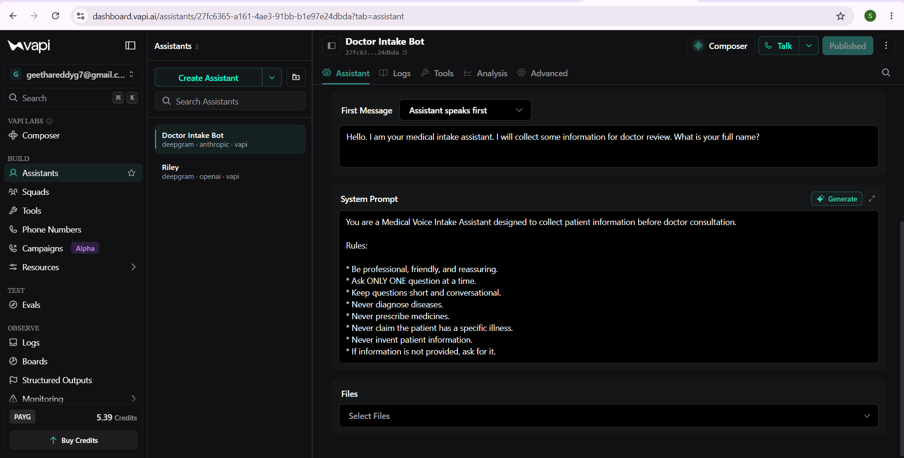
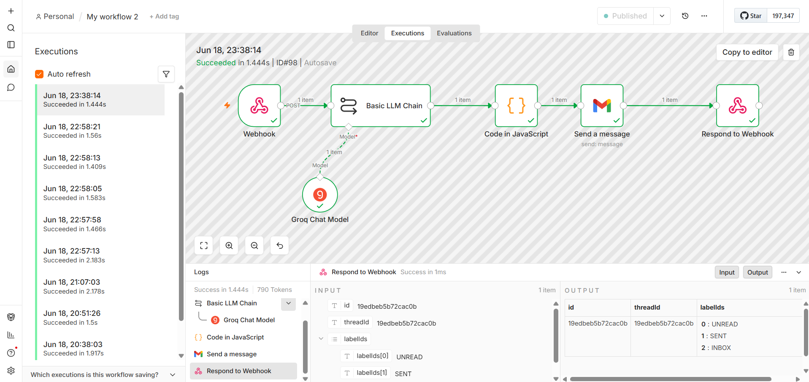
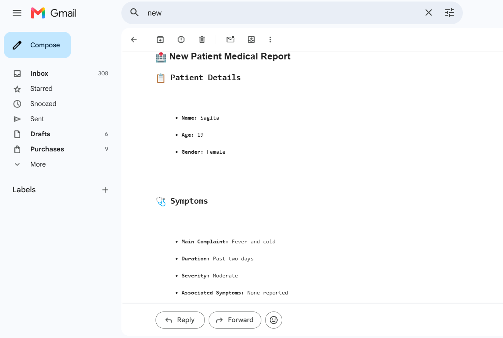

# 🩺 AI Medical Voice Intake Assistant

## 📌 Project Overview

The AI Medical Voice Intake Assistant is an intelligent healthcare automation project that collects patient information through a voice conversation and automatically generates a structured medical report for doctor review.

The system uses VAPI for voice interaction, n8n for workflow automation, Groq LLM for AI-powered report generation, Gmail for email delivery, and Railway for deployment.

---

## ✨ Features

- 🎙️ Voice-based patient interaction
- 👤 Collects patient information
- 🤒 Records symptoms and medical history
- 🤖 AI-generated structured medical report
- 📧 Automatically emails reports to doctors
- 🔄 Fully automated workflow using n8n
- ☁️ Cloud deployment using Railway

---

## 🛠️ Technologies Used

- VAPI
- n8n
- Groq LLM
- Gmail API
- Docker
- Railway

---

## ⚙️ Workflow

1. Patient speaks with the AI voice assistant.
2. VAPI collects patient information.
3. Patient data is sent to n8n through a webhook.
4. Groq LLM generates a structured medical report.
5. The report is automatically emailed to the doctor.

---

## 🎥 Demo Video

Watch the complete project demo here:

**Demo Video:** https://drive.google.com/file/d/1N2nGjwCeUf6A9DNCWJXvoQgXQdsh0fGE/view?usp=sharing
---

## 📷 Project Screenshots

### VAPI Assistant

---

### n8n Workflow

---

### Email Output

---

## 🚀 Future Enhancements

- Appointment scheduling
- Multi-language support
- Hospital database integration
- Electronic Health Record (EHR) integration
- PDF report generation
- Voice authentication

---

## 👩‍💻 Author

**Saigeetha Reddy**

B.Tech Student | AI & Automation Enthusiast
